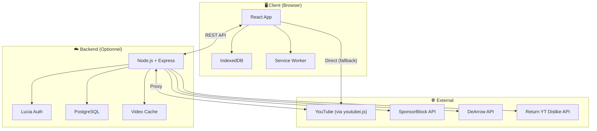
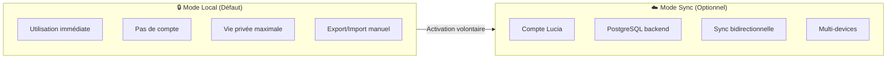
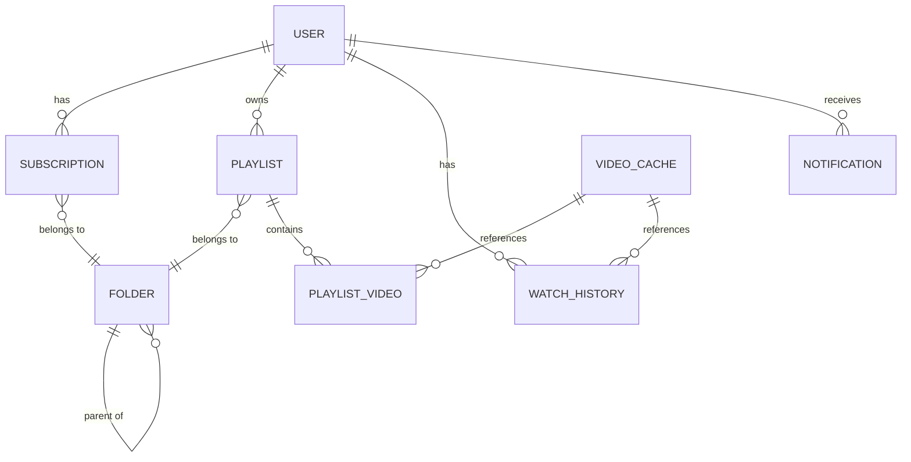
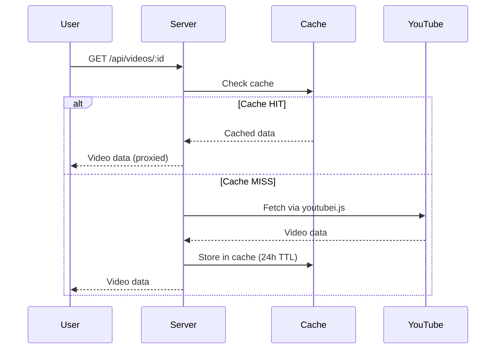
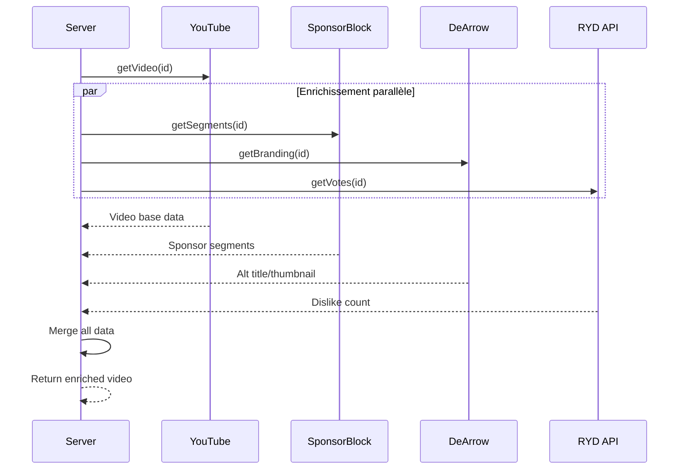
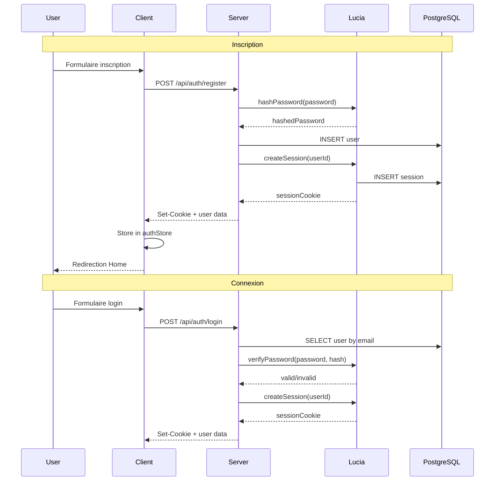
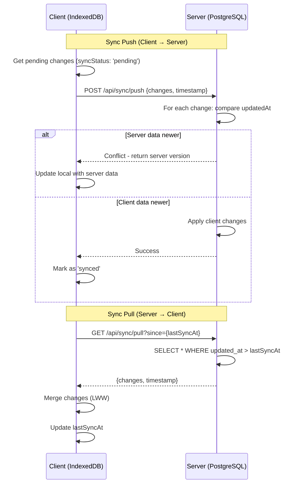
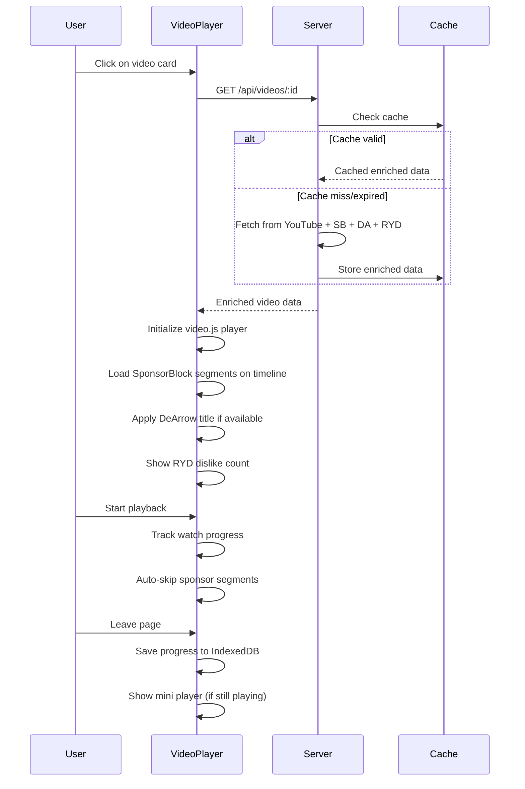
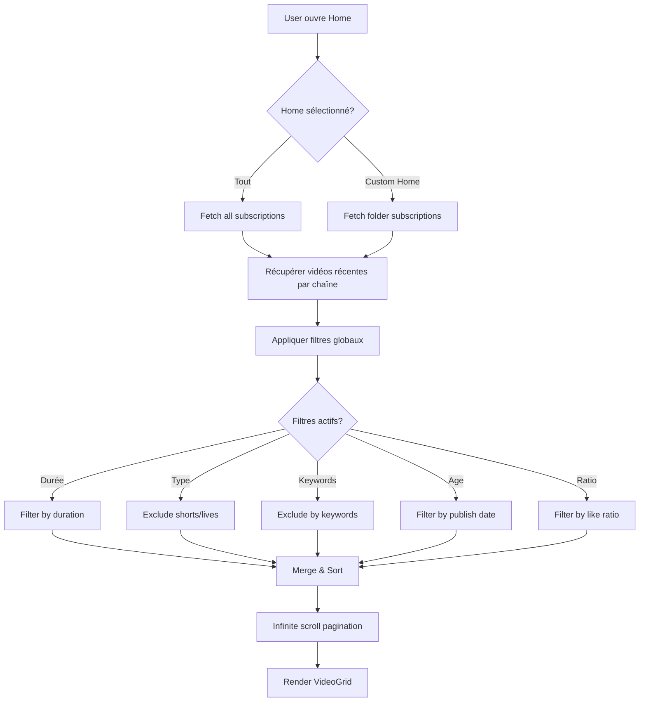
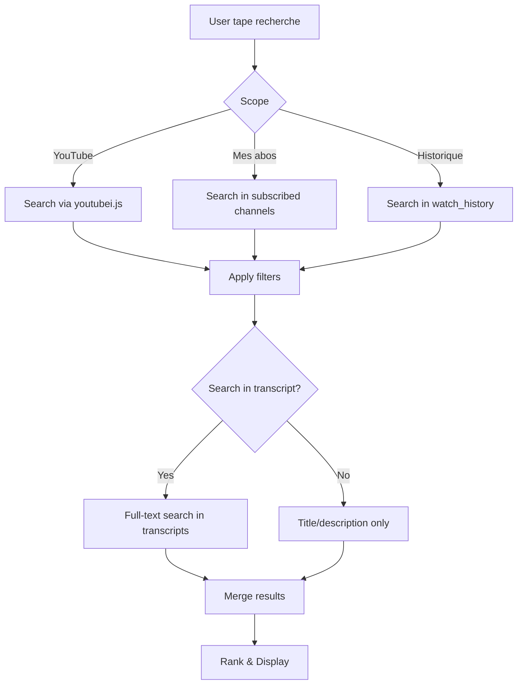

# 🏗️ Architecture Technique - Vids

**Version :** 1.0  
**Date :** 2026-01-07  
**Statut :** Validé

---

## Table des matières

1. [High Level Architecture](#high-level-architecture)
2. [Tech Stack](#tech-stack)
3. [Data Models](#data-models)
4. [Components](#components)
5. [External APIs](#external-apis)
6. [Core Workflows](#core-workflows)
7. [Error Handling & Security](#error-handling--security)

---

## High Level Architecture

### Vue d'ensemble

Vids est une application **offline-first** avec synchronisation optionnelle. L'architecture hybride permet deux modes d'utilisation :



### Patterns Architecturaux

| Pattern | Application |
|---------|-------------|
| **Offline-First** | IndexedDB comme source de vérité locale, sync optionnelle |
| **Proxy Caching** | Backend cache les métadonnées YouTube pour protéger la vie privée |
| **Last-Write-Wins** | Stratégie de résolution de conflits simple via timestamps |
| **Component-Based** | React avec composition de composants réutilisables |
| **API Gateway** | Backend centralise les appels aux APIs externes |

### Modes de fonctionnement



---

## Tech Stack

### Frontend

| Technologie | Justification |
|-------------|---------------|
| **React 18** | Écosystème mature, hooks, Concurrent Features pour UX fluide |
| **Vite** | Build ultra-rapide, HMR instantané, ESM natif |
| **Vanilla CSS** | Contrôle total, design system custom, pas de dépendance utility-first |
| **Framer Motion** | Animations organiques de qualité Awwwards, API déclarative |
| **video.js** | Player extensible, plugins SponsorBlock/chapitres, qualité production |
| **Phosphor Icons** | Cohérence visuelle, poids léger, style outline/fill |
| **React Router v6** | Routing déclaratif, nested routes, data loading |
| **Dexie.js** | Wrapper IndexedDB avec API Promise, reactive queries |

### Backend

| Technologie | Justification |
|-------------|---------------|
| **Node.js 20+** | Runtime JavaScript unifié, écosystème npm, performance async |
| **Express** | Minimaliste, middleware extensible, standard de facto |
| **PostgreSQL** | JSONB pour flexibilité, full-text search, robustesse |
| **Lucia v3** | Auth moderne, sessions sécurisées, adapters multiples |
| **youtubei.js** | API YouTube non-officielle, pas de quota Google, extraction complète |
| **node-cache** | Cache in-memory pour métadonnées YouTube |

### Fonts & Design

| Élément | Choix |
|---------|-------|
| **Font UI** | Sora (Google Fonts) - Moderne, géométrique |
| **Font Text** | Lora (Google Fonts) - Lisibilité, personnalité |
| **Icons** | Phosphor Icons - Outline par défaut, fill pour actif |

### DevOps & Tooling

| Outil | Usage |
|-------|-------|
| **pnpm** | Gestionnaire de packages rapide, disk-efficient |
| **ESLint + Prettier** | Linting et formatting |
| **TypeScript** | Type safety sur tout le codebase |
| **Docker** | Containerisation backend + PostgreSQL |

---

## Data Models

### Schéma conceptuel



### Interfaces TypeScript

```typescript
// ==================== USER & AUTH ====================

interface User {
  id: string;                    // UUID
  email: string;
  passwordHash: string;
  createdAt: Date;
  updatedAt: Date;
  settings: UserSettings;
}

interface UserSettings {
  defaultPlaybackSpeed: number;  // 0.25 - 3.0
  theme: 'dark' | 'light' | 'system';
  sponsorBlockEnabled: boolean;
  deArrowEnabled: boolean;
  rydEnabled: boolean;
  autoplay: boolean;
  defaultQuality: 'auto' | '1080p' | '720p' | '480p' | '360p';
}

interface Session {
  id: string;
  userId: string;
  expiresAt: Date;
  userAgent: string;
  ipAddress: string;
}

// ==================== SUBSCRIPTIONS ====================

interface Subscription {
  id: string;                    // UUID (local) ou SERIAL (server)
  channelId: string;             // YouTube channel ID
  channelName: string;
  channelAvatar: string;
  folderId: string | null;
  playbackSpeed: number;         // Override par chaîne
  filters: ChannelFilters;
  subscribedAt: Date;
  updatedAt: Date;               // Pour sync LWW
  syncStatus: SyncStatus;
}

interface ChannelFilters {
  minDuration: number | null;    // En secondes
  maxDuration: number | null;
  excludeKeywords: string[];
  includeKeywords: string[];
  excludeShorts: boolean;
  excludeLives: boolean;
}

type SyncStatus = 'synced' | 'pending' | 'conflict';

// ==================== FOLDERS ====================

interface Folder {
  id: string;
  name: string;
  parentId: string | null;       // Pour nested folders
  color: string;                 // Hex color
  icon: string;                  // Phosphor icon name
  filters: FolderFilters;
  homeEnabled: boolean;          // Visible dans Home selector
  order: number;                 // Pour ordering
  createdAt: Date;
  updatedAt: Date;
  syncStatus: SyncStatus;
}

interface FolderFilters {
  minDuration: number | null;
  maxDuration: number | null;
  minLikeRatio: number | null;   // 0-100
  maxAge: number | null;         // En jours
}

// ==================== VIDEOS ====================

interface VideoCache {
  videoId: string;               // YouTube video ID (PK)
  title: string;
  titleDeArrow: string | null;   // Titre alternatif DeArrow
  channelId: string;
  channelName: string;
  description: string;
  duration: number;              // En secondes
  publishedAt: Date;
  thumbnailUrl: string;
  thumbnailDeArrow: string | null;
  viewCount: number;
  likeCount: number;
  dislikeCount: number;          // Via RYD API
  commentCount: number;
  transcript: string | null;     // Pour recherche
  chapters: Chapter[];
  sponsorSegments: SponsorSegment[];
  cachedAt: Date;
  expiresAt: Date;               // TTL du cache
}

interface Chapter {
  title: string;
  startTime: number;             // En secondes
  thumbnailUrl: string | null;
}

interface SponsorSegment {
  startTime: number;
  endTime: number;
  category: SponsorCategory;
  actionType: 'skip' | 'mute' | 'full';
}

type SponsorCategory = 
  | 'sponsor' 
  | 'selfpromo' 
  | 'interaction' 
  | 'intro' 
  | 'outro' 
  | 'preview' 
  | 'filler' 
  | 'music_offtopic';

// ==================== WATCH HISTORY ====================

interface WatchHistory {
  id: string;
  videoId: string;
  watchedAt: Date;
  durationWatched: number;       // En secondes
  totalDuration: number;
  completed: boolean;            // > 90% regardé
  rating: 'like' | 'dislike' | null;
  playbackSpeed: number;
  updatedAt: Date;
  syncStatus: SyncStatus;
}

// ==================== PLAYLISTS ====================

interface Playlist {
  id: string;
  name: string;
  description: string;
  folderId: string | null;
  isWatchLater: boolean;         // Playlist spéciale
  isFavorites: boolean;          // Playlist spéciale
  thumbnailUrl: string | null;   // Généré ou custom
  videoCount: number;
  totalDuration: number;
  createdAt: Date;
  updatedAt: Date;
  syncStatus: SyncStatus;
}

interface PlaylistVideo {
  id: string;
  playlistId: string;
  videoId: string;
  order: number;
  addedAt: Date;
}

// ==================== NOTIFICATIONS ====================

interface Notification {
  id: string;
  type: NotificationType;
  title: string;
  message: string;
  videoId: string | null;
  channelId: string | null;
  read: boolean;
  createdAt: Date;
}

type NotificationType = 
  | 'new_video' 
  | 'channel_update' 
  | 'playlist_update'
  | 'system';

// ==================== SYNC ====================

interface SyncMetadata {
  lastSyncAt: Date;
  deviceId: string;
  syncEnabled: boolean;
}

interface SyncPayload {
  subscriptions: Subscription[];
  folders: Folder[];
  playlists: Playlist[];
  playlistVideos: PlaylistVideo[];
  watchHistory: WatchHistory[];
  timestamp: Date;
}
```

### Schéma PostgreSQL

```sql
-- Extensions
CREATE EXTENSION IF NOT EXISTS "uuid-ossp";
CREATE EXTENSION IF NOT EXISTS "pg_trgm";  -- Pour full-text search

-- ==================== AUTH (Lucia) ====================

CREATE TABLE users (
  id UUID PRIMARY KEY DEFAULT uuid_generate_v4(),
  email VARCHAR(255) UNIQUE NOT NULL,
  password_hash VARCHAR(255) NOT NULL,
  settings JSONB DEFAULT '{}',
  created_at TIMESTAMPTZ DEFAULT NOW(),
  updated_at TIMESTAMPTZ DEFAULT NOW()
);

CREATE TABLE sessions (
  id VARCHAR(255) PRIMARY KEY,
  user_id UUID NOT NULL REFERENCES users(id) ON DELETE CASCADE,
  expires_at TIMESTAMPTZ NOT NULL,
  user_agent TEXT,
  ip_address INET,
  created_at TIMESTAMPTZ DEFAULT NOW()
);

CREATE INDEX idx_sessions_user_id ON sessions(user_id);
CREATE INDEX idx_sessions_expires_at ON sessions(expires_at);

-- ==================== FOLDERS ====================

CREATE TABLE folders (
  id UUID PRIMARY KEY DEFAULT uuid_generate_v4(),
  user_id UUID NOT NULL REFERENCES users(id) ON DELETE CASCADE,
  name VARCHAR(100) NOT NULL,
  parent_id UUID REFERENCES folders(id) ON DELETE SET NULL,
  color VARCHAR(7) DEFAULT '#7c7cf5',
  icon VARCHAR(50) DEFAULT 'folder',
  filters JSONB DEFAULT '{}',
  home_enabled BOOLEAN DEFAULT false,
  "order" INT DEFAULT 0,
  created_at TIMESTAMPTZ DEFAULT NOW(),
  updated_at TIMESTAMPTZ DEFAULT NOW(),
  UNIQUE(user_id, name, parent_id)
);

CREATE INDEX idx_folders_user_id ON folders(user_id);

-- ==================== SUBSCRIPTIONS ====================

CREATE TABLE subscriptions (
  id UUID PRIMARY KEY DEFAULT uuid_generate_v4(),
  user_id UUID NOT NULL REFERENCES users(id) ON DELETE CASCADE,
  channel_id VARCHAR(50) NOT NULL,
  channel_name VARCHAR(255) NOT NULL,
  channel_avatar TEXT,
  folder_id UUID REFERENCES folders(id) ON DELETE SET NULL,
  playback_speed FLOAT DEFAULT 1.0,
  filters JSONB DEFAULT '{}',
  subscribed_at TIMESTAMPTZ DEFAULT NOW(),
  updated_at TIMESTAMPTZ DEFAULT NOW(),
  UNIQUE(user_id, channel_id)
);

CREATE INDEX idx_subscriptions_user_id ON subscriptions(user_id);
CREATE INDEX idx_subscriptions_channel_id ON subscriptions(channel_id);
CREATE INDEX idx_subscriptions_folder_id ON subscriptions(folder_id);

-- ==================== VIDEO CACHE (Partagé entre users) ====================

CREATE TABLE video_cache (
  video_id VARCHAR(20) PRIMARY KEY,
  title TEXT NOT NULL,
  title_dearrow TEXT,
  channel_id VARCHAR(50) NOT NULL,
  channel_name VARCHAR(255) NOT NULL,
  description TEXT,
  duration INT NOT NULL,
  published_at TIMESTAMPTZ,
  thumbnail_url TEXT,
  thumbnail_dearrow TEXT,
  view_count BIGINT DEFAULT 0,
  like_count INT DEFAULT 0,
  dislike_count INT DEFAULT 0,
  comment_count INT DEFAULT 0,
  transcript TEXT,
  chapters JSONB DEFAULT '[]',
  sponsor_segments JSONB DEFAULT '[]',
  cached_at TIMESTAMPTZ DEFAULT NOW(),
  expires_at TIMESTAMPTZ DEFAULT NOW() + INTERVAL '24 hours'
);

CREATE INDEX idx_video_cache_channel_id ON video_cache(channel_id);
CREATE INDEX idx_video_cache_expires_at ON video_cache(expires_at);
CREATE INDEX idx_video_cache_transcript ON video_cache USING gin(to_tsvector('english', transcript));

-- ==================== WATCH HISTORY ====================

CREATE TABLE watch_history (
  id UUID PRIMARY KEY DEFAULT uuid_generate_v4(),
  user_id UUID NOT NULL REFERENCES users(id) ON DELETE CASCADE,
  video_id VARCHAR(20) NOT NULL,
  watched_at TIMESTAMPTZ DEFAULT NOW(),
  duration_watched INT DEFAULT 0,
  total_duration INT NOT NULL,
  completed BOOLEAN DEFAULT false,
  rating VARCHAR(10) CHECK (rating IN ('like', 'dislike', NULL)),
  playback_speed FLOAT DEFAULT 1.0,
  updated_at TIMESTAMPTZ DEFAULT NOW()
);

CREATE INDEX idx_watch_history_user_id ON watch_history(user_id);
CREATE INDEX idx_watch_history_video_id ON watch_history(video_id);
CREATE INDEX idx_watch_history_watched_at ON watch_history(watched_at DESC);

-- ==================== PLAYLISTS ====================

CREATE TABLE playlists (
  id UUID PRIMARY KEY DEFAULT uuid_generate_v4(),
  user_id UUID NOT NULL REFERENCES users(id) ON DELETE CASCADE,
  name VARCHAR(255) NOT NULL,
  description TEXT,
  folder_id UUID REFERENCES folders(id) ON DELETE SET NULL,
  is_watch_later BOOLEAN DEFAULT false,
  is_favorites BOOLEAN DEFAULT false,
  thumbnail_url TEXT,
  video_count INT DEFAULT 0,
  total_duration INT DEFAULT 0,
  created_at TIMESTAMPTZ DEFAULT NOW(),
  updated_at TIMESTAMPTZ DEFAULT NOW()
);

CREATE INDEX idx_playlists_user_id ON playlists(user_id);

CREATE TABLE playlist_videos (
  id UUID PRIMARY KEY DEFAULT uuid_generate_v4(),
  playlist_id UUID NOT NULL REFERENCES playlists(id) ON DELETE CASCADE,
  video_id VARCHAR(20) NOT NULL,
  "order" INT NOT NULL,
  added_at TIMESTAMPTZ DEFAULT NOW(),
  UNIQUE(playlist_id, video_id)
);

CREATE INDEX idx_playlist_videos_playlist_id ON playlist_videos(playlist_id);

-- ==================== NOTIFICATIONS ====================

CREATE TABLE notifications (
  id UUID PRIMARY KEY DEFAULT uuid_generate_v4(),
  user_id UUID NOT NULL REFERENCES users(id) ON DELETE CASCADE,
  type VARCHAR(50) NOT NULL,
  title VARCHAR(255) NOT NULL,
  message TEXT,
  video_id VARCHAR(20),
  channel_id VARCHAR(50),
  read BOOLEAN DEFAULT false,
  created_at TIMESTAMPTZ DEFAULT NOW()
);

CREATE INDEX idx_notifications_user_id ON notifications(user_id);
CREATE INDEX idx_notifications_read ON notifications(user_id, read);
CREATE INDEX idx_notifications_created_at ON notifications(created_at DESC);

-- ==================== CLEANUP JOBS ====================

-- Fonction pour nettoyer le cache expiré
CREATE OR REPLACE FUNCTION cleanup_expired_cache()
RETURNS void AS $$
BEGIN
  DELETE FROM video_cache WHERE expires_at < NOW();
END;
$$ LANGUAGE plpgsql;
```

### Schéma IndexedDB (Dexie.js)

```typescript
import Dexie, { Table } from 'dexie';

class VidsDatabase extends Dexie {
  subscriptions!: Table<Subscription>;
  folders!: Table<Folder>;
  videoCache!: Table<VideoCache>;
  watchHistory!: Table<WatchHistory>;
  playlists!: Table<Playlist>;
  playlistVideos!: Table<PlaylistVideo>;
  notifications!: Table<Notification>;
  syncMetadata!: Table<SyncMetadata>;

  constructor() {
    super('VidsDB');
    
    this.version(1).stores({
      subscriptions: 'id, channelId, folderId, updatedAt, syncStatus',
      folders: 'id, parentId, name, updatedAt, syncStatus',
      videoCache: 'videoId, channelId, publishedAt, cachedAt',
      watchHistory: 'id, videoId, watchedAt, completed, updatedAt, syncStatus',
      playlists: 'id, folderId, isWatchLater, isFavorites, updatedAt, syncStatus',
      playlistVideos: 'id, playlistId, videoId, [playlistId+order]',
      notifications: 'id, type, read, createdAt',
      syncMetadata: 'deviceId'
    });
  }
}

export const db = new VidsDatabase();
```

---

## Components

### Structure des fichiers

```
vids/
├── public/
│   ├── fonts/
│   │   ├── Sora-*.woff2
│   │   └── Lora-*.woff2
│   └── icons/
│       └── phosphor/
│
├── src/
│   ├── main.tsx                    # Entry point
│   ├── App.tsx                     # Root component + routing
│   │
│   ├── assets/
│   │   └── styles/
│   │       ├── index.css           # Global styles + reset
│   │       ├── variables.css       # Design tokens
│   │       ├── typography.css      # Font definitions
│   │       └── animations.css      # Framer Motion presets
│   │
│   ├── components/
│   │   ├── common/
│   │   │   ├── Button/
│   │   │   │   ├── Button.tsx
│   │   │   │   └── Button.css
│   │   │   ├── Input/
│   │   │   ├── Modal/
│   │   │   ├── Dropdown/
│   │   │   ├── Spinner/
│   │   │   ├── Toast/
│   │   │   └── EmptyState/
│   │   │
│   │   ├── layout/
│   │   │   ├── Navbar/             # Bottom navbar squircle
│   │   │   ├── Searchbar/          # Top search + icons
│   │   │   ├── PageLayout/
│   │   │   └── MiniPlayer/         # Floating mini player
│   │   │
│   │   ├── video/
│   │   │   ├── VideoCard/          # Card avec preview hover
│   │   │   ├── VideoPlayer/        # Player principal video.js
│   │   │   ├── VideoGrid/          # Grille responsive
│   │   │   ├── VideoInfo/          # Titre, chaîne, stats
│   │   │   ├── ChaptersBar/
│   │   │   ├── SponsorBar/         # Segments SponsorBlock
│   │   │   └── Comments/
│   │   │
│   │   ├── feed/
│   │   │   ├── HomeFeed/
│   │   │   ├── HomeSelector/       # Dropdown homes
│   │   │   ├── FilterBar/
│   │   │   └── InfiniteScroll/
│   │   │
│   │   ├── subscriptions/
│   │   │   ├── ChannelCard/
│   │   │   ├── FolderTree/
│   │   │   └── ImportModal/
│   │   │
│   │   ├── playlists/
│   │   │   ├── PlaylistCard/
│   │   │   ├── PlaylistEditor/
│   │   │   └── DraggableList/
│   │   │
│   │   ├── search/
│   │   │   ├── SearchResults/
│   │   │   ├── AdvancedFilters/
│   │   │   └── TranscriptSearch/
│   │   │
│   │   └── notifications/
│   │       ├── NotificationBell/
│   │       └── NotificationList/
│   │
│   ├── pages/
│   │   ├── Home.tsx
│   │   ├── Watch.tsx               # Page vidéo
│   │   ├── Search.tsx
│   │   ├── Subscriptions.tsx
│   │   ├── Playlists.tsx
│   │   ├── Trending.tsx
│   │   ├── WatchLater.tsx
│   │   ├── History.tsx
│   │   ├── Settings.tsx
│   │   ├── Auth/
│   │   │   ├── Login.tsx
│   │   │   └── Register.tsx
│   │   └── errors/
│   │       ├── NotFound.tsx
│   │       └── Error.tsx
│   │
│   ├── hooks/
│   │   ├── useAuth.ts              # Lucia auth state
│   │   ├── useSubscriptions.ts
│   │   ├── usePlaylists.ts
│   │   ├── useWatchHistory.ts
│   │   ├── useVideoPlayer.ts
│   │   ├── useInfiniteScroll.ts
│   │   ├── useSearch.ts
│   │   ├── useSync.ts              # Sync bidirectionnel
│   │   ├── useLocalDB.ts           # Dexie operations
│   │   └── useNotifications.ts
│   │
│   ├── services/
│   │   ├── api/
│   │   │   ├── client.ts           # Axios instance
│   │   │   ├── auth.ts
│   │   │   ├── videos.ts
│   │   │   ├── subscriptions.ts
│   │   │   ├── playlists.ts
│   │   │   └── sync.ts
│   │   │
│   │   ├── youtube/
│   │   │   ├── client.ts           # youtubei.js wrapper
│   │   │   ├── search.ts
│   │   │   └── video.ts
│   │   │
│   │   ├── integrations/
│   │   │   ├── sponsorblock.ts
│   │   │   ├── dearrow.ts
│   │   │   └── returnyoutubedislike.ts
│   │   │
│   │   └── db/
│   │       ├── index.ts            # Dexie instance
│   │       └── migrations.ts
│   │
│   ├── stores/
│   │   ├── authStore.ts            # Zustand - Auth state
│   │   ├── playerStore.ts          # Player state + mini player
│   │   ├── feedStore.ts            # Feed + filters
│   │   └── syncStore.ts            # Sync status
│   │
│   ├── utils/
│   │   ├── formatters.ts           # Date, duration, views
│   │   ├── validators.ts
│   │   ├── storage.ts              # LocalStorage helpers
│   │   └── constants.ts
│   │
│   └── types/
│       ├── index.ts
│       ├── api.ts
│       └── youtube.ts
│
├── server/
│   ├── index.ts                    # Entry point Express
│   ├── config/
│   │   ├── database.ts             # PostgreSQL connection
│   │   ├── lucia.ts                # Lucia auth config
│   │   └── cache.ts                # node-cache config
│   │
│   ├── routes/
│   │   ├── index.ts
│   │   ├── auth.ts
│   │   ├── videos.ts
│   │   ├── subscriptions.ts
│   │   ├── playlists.ts
│   │   ├── search.ts
│   │   └── sync.ts
│   │
│   ├── controllers/
│   │   ├── authController.ts
│   │   ├── videoController.ts
│   │   ├── subscriptionController.ts
│   │   ├── playlistController.ts
│   │   ├── searchController.ts
│   │   └── syncController.ts
│   │
│   ├── services/
│   │   ├── youtubeService.ts       # youtubei.js wrapper
│   │   ├── cacheService.ts         # Video cache management
│   │   ├── sponsorBlockService.ts
│   │   ├── deArrowService.ts
│   │   └── rydService.ts
│   │
│   ├── middleware/
│   │   ├── auth.ts                 # Lucia middleware
│   │   ├── rateLimit.ts
│   │   ├── cache.ts
│   │   └── errorHandler.ts
│   │
│   ├── models/
│   │   └── index.ts                # Types partagés
│   │
│   └── utils/
│       ├── logger.ts
│       └── validators.ts
│
├── docker/
│   ├── Dockerfile
│   └── docker-compose.yml
│
├── package.json
├── tsconfig.json
├── vite.config.ts
└── README.md
```

### Responsabilités des modules

| Module | Responsabilité |
|--------|----------------|
| **components/common/** | Composants UI réutilisables (Button, Modal, Input...) |
| **components/layout/** | Structure globale (Navbar, Searchbar, MiniPlayer) |
| **components/video/** | Tout ce qui concerne l'affichage et lecture de vidéos |
| **components/feed/** | Gestion du feed principal et filtrage |
| **hooks/** | Logique métier réutilisable, state management |
| **services/api/** | Communication avec le backend |
| **services/youtube/** | Wrapper youtubei.js (client-side fallback) |
| **services/db/** | Opérations IndexedDB via Dexie |
| **stores/** | État global (Zustand) pour auth, player, sync |
| **server/routes/** | Endpoints REST API |
| **server/services/** | Logique métier backend, intégrations externes |

---

## External APIs

### YouTube Data (via youtubei.js)

```typescript
// Pas de clé API nécessaire - youtubei.js utilise les APIs internes YouTube

interface YouTubeService {
  // Recherche
  search(query: string, options?: SearchOptions): Promise<SearchResult[]>;
  
  // Vidéo
  getVideo(videoId: string): Promise<VideoDetails>;
  getVideoStream(videoId: string, quality?: Quality): Promise<StreamUrl>;
  
  // Chaîne
  getChannel(channelId: string): Promise<ChannelInfo>;
  getChannelVideos(channelId: string, options?: PaginationOptions): Promise<Video[]>;
  
  // Trending
  getTrending(category?: TrendingCategory): Promise<Video[]>;
}
```

**Stratégie de cache proxy :**



### SponsorBlock API

```typescript
// Endpoint: https://sponsor.ajay.app/api/

interface SponsorBlockService {
  getSegments(videoId: string): Promise<SponsorSegment[]>;
  
  // Catégories supportées
  categories: [
    'sponsor',      // Publicité intégrée
    'selfpromo',    // Auto-promotion
    'interaction',  // "Like & Subscribe"
    'intro',        // Intro/Animation
    'outro',        // Outro/Fin
    'preview',      // Preview/Recap
    'filler',       // Contenu de remplissage
    'music_offtopic' // Musique hors-sujet
  ];
}
```

### DeArrow API

```typescript
// Endpoint: https://sponsor.ajay.app/api/branding

interface DeArrowService {
  getBranding(videoId: string): Promise<{
    title: string | null;         // Titre alternatif
    thumbnail: string | null;     // Thumbnail alternatif
  }>;
}
```

### Return YouTube Dislike API

```typescript
// Endpoint: https://returnyoutubedislikeapi.com/

interface RYDService {
  getVotes(videoId: string): Promise<{
    likes: number;
    dislikes: number;
    rating: number;    // 1-5 scale
    viewCount: number;
  }>;
}
```

### Flux d'enrichissement vidéo



---

## Core Workflows

### 1. Authentification (Lucia)



### 2. Synchronisation bidirectionnelle



### 3. Lecture vidéo avec intégrations



### 4. Feed avec filtres



### 5. Recherche multi-niveau



---

## Error Handling & Security

### Stratégie de gestion d'erreurs

```typescript
// Types d'erreurs
enum ErrorType {
  NETWORK = 'NETWORK_ERROR',
  AUTH = 'AUTH_ERROR',
  NOT_FOUND = 'NOT_FOUND',
  RATE_LIMIT = 'RATE_LIMIT',
  YOUTUBE_UNAVAILABLE = 'YOUTUBE_UNAVAILABLE',
  VALIDATION = 'VALIDATION_ERROR',
  SERVER = 'SERVER_ERROR'
}

// Structure erreur standardisée
interface AppError {
  type: ErrorType;
  message: string;
  userMessage: string;  // Message rigolo pour l'UI
  retryable: boolean;
  retryAfter?: number;  // En secondes
}

// Messages utilisateur rigolos
const userMessages: Record<ErrorType, string> = {
  NETWORK_ERROR: "Internet a disparu. Vérifie ta connexion (ou appelle un exorciste) 👻",
  AUTH_ERROR: "Session expirée. Reconnecte-toi pour continuer 🔐",
  NOT_FOUND: "Cette vidéo est partie en vacances sans prévenir 🏖️",
  RATE_LIMIT: "Doucement ! YouTube a besoin de souffler. Réessaie dans 1 min ⏳",
  YOUTUBE_UNAVAILABLE: "YouTube fait la sieste. On réessaie ? 😴",
  VALIDATION_ERROR: "Quelque chose cloche dans ta requête 🤔",
  SERVER_ERROR: "Le serveur a besoin d'un café. Reviens dans 2 min ? ☕"
};
```

### Retry Strategy

```typescript
// Exponential backoff avec jitter
const retryConfig = {
  maxRetries: 3,
  baseDelay: 1000,      // 1s
  maxDelay: 30000,      // 30s
  jitterFactor: 0.5,
  
  retryableErrors: [
    ErrorType.NETWORK,
    ErrorType.RATE_LIMIT,
    ErrorType.YOUTUBE_UNAVAILABLE,
    ErrorType.SERVER
  ]
};

async function fetchWithRetry<T>(
  fn: () => Promise<T>,
  config = retryConfig
): Promise<T> {
  let lastError: Error;
  
  for (let attempt = 0; attempt < config.maxRetries; attempt++) {
    try {
      return await fn();
    } catch (error) {
      lastError = error;
      
      if (!isRetryable(error)) throw error;
      
      const delay = calculateDelay(attempt, config);
      await sleep(delay);
    }
  }
  
  throw lastError;
}
```

### Sécurité

#### Authentification (Lucia)

```typescript
// Configuration Lucia sécurisée
const lucia = new Lucia(adapter, {
  sessionCookie: {
    name: 'vids_session',
    expires: false,  // Session cookie
    attributes: {
      secure: process.env.NODE_ENV === 'production',
      httpOnly: true,
      sameSite: 'lax',
      path: '/'
    }
  },
  getUserAttributes: (attributes) => ({
    email: attributes.email
  })
});
```

#### Rate Limiting

```typescript
// Par IP + par user
const rateLimitConfig = {
  // API générale
  global: {
    windowMs: 60 * 1000,   // 1 minute
    max: 100               // 100 requêtes/min
  },
  
  // Auth (plus strict)
  auth: {
    windowMs: 15 * 60 * 1000,  // 15 minutes
    max: 10                     // 10 tentatives
  },
  
  // YouTube proxy (éviter abuse)
  youtube: {
    windowMs: 60 * 1000,
    max: 30
  },
  
  // Sync
  sync: {
    windowMs: 60 * 1000,
    max: 5
  }
};
```

#### Validation des entrées

```typescript
import { z } from 'zod';

// Schémas de validation
const schemas = {
  register: z.object({
    email: z.string().email(),
    password: z.string().min(8).max(128)
  }),
  
  subscription: z.object({
    channelId: z.string().regex(/^UC[\w-]{22}$/),
    folderId: z.string().uuid().optional()
  }),
  
  playlist: z.object({
    name: z.string().min(1).max(255),
    description: z.string().max(2000).optional()
  }),
  
  search: z.object({
    query: z.string().min(1).max(500),
    scope: z.enum(['youtube', 'subscriptions', 'history']),
    filters: z.object({
      minDuration: z.number().optional(),
      maxDuration: z.number().optional(),
      minLikeRatio: z.number().min(0).max(100).optional()
    }).optional()
  })
};
```

#### Protection CORS

```typescript
const corsConfig = {
  origin: process.env.NODE_ENV === 'production'
    ? 'https://vids.tllm.fr'
    : ['http://localhost:5173', 'http://localhost:3000'],
  credentials: true,
  methods: ['GET', 'POST', 'PUT', 'DELETE', 'PATCH'],
  allowedHeaders: ['Content-Type', 'Authorization']
};
```

#### Headers de sécurité

```typescript
// Helmet configuration
const helmetConfig = {
  contentSecurityPolicy: {
    directives: {
      defaultSrc: ["'self'"],
      scriptSrc: ["'self'"],
      styleSrc: ["'self'", "'unsafe-inline'", "https://fonts.googleapis.com"],
      fontSrc: ["'self'", "https://fonts.gstatic.com"],
      imgSrc: ["'self'", "data:", "https://i.ytimg.com", "https://yt3.ggpht.com"],
      mediaSrc: ["'self'", "https://*.googlevideo.com"],
      connectSrc: [
        "'self'",
        "https://sponsor.ajay.app",
        "https://returnyoutubedislikeapi.com"
      ]
    }
  },
  referrerPolicy: { policy: 'strict-origin-when-cross-origin' }
};
```

### Logging & Monitoring

```typescript
// Structure de log
interface LogEntry {
  timestamp: Date;
  level: 'debug' | 'info' | 'warn' | 'error';
  message: string;
  context: {
    userId?: string;
    requestId?: string;
    path?: string;
    method?: string;
    duration?: number;
    error?: {
      type: string;
      message: string;
      stack?: string;
    };
  };
}

// Métriques à tracker
const metrics = {
  // Performance
  apiLatency: 'histogram',
  cacheHitRate: 'gauge',
  
  // Usage
  activeUsers: 'gauge',
  videosWatched: 'counter',
  searchQueries: 'counter',
  
  // Errors
  errorsByType: 'counter',
  youtubeFailures: 'counter'
};
```

---

## Validation Croisée PRD ↔ Architecture

| User Story (PRD/idea.md) | Composant Architecture |
|--------------------------|------------------------|
| Home feed avec toutes les vidéos | `HomeFeed`, `VideoGrid`, `InfiniteScroll` |
| Homes par catégorie | `HomeSelector`, `Folder.homeEnabled` |
| Player avec intégrations | `VideoPlayer`, `SponsorBar`, `ChaptersBar` |
| Mini player flottant | `MiniPlayer`, `playerStore` |
| Dossiers & organisation | `FolderTree`, `Folder` model |
| Filtres avancés | `FilterBar`, `FolderFilters`, `ChannelFilters` |
| Recherche multi-niveau | `SearchResults`, `TranscriptSearch` |
| Vitesse par chaîne | `Subscription.playbackSpeed` |
| Import abonnements CSV | `ImportModal` |
| Notifications | `NotificationBell`, `Notification` model |
| Auth optionnelle | `Lucia`, mode local vs sync |
| Offline-first | `IndexedDB`, `Dexie`, `syncStore` |

---

> [!NOTE]
> Cette architecture est conçue pour évoluer. Les phases 1-2 peuvent être implémentées sans le backend complet (mode 100% local), puis le backend peut être ajouté progressivement.
